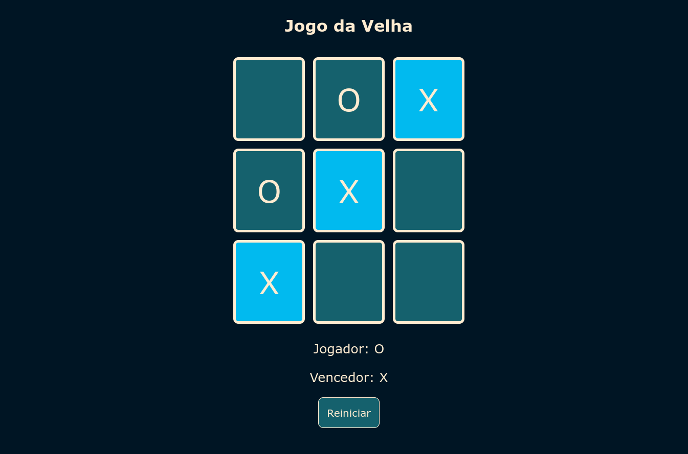

# Jogo da Velha :x::o:
* Jogo da velha desenvolvido com HTML, CSS e JavaScript no curso "Criando seu próprio jogo da velha com HTML e Javascript" da DIO. :computer:

* Nele, vários conceitos de manipulação do DOM foram utilizados.

* Você pode encontrar o jogo <a href="https://doglasrocha.github.io/jogo-da-velha/" target="_blank">aqui</a>!

* Imagem do jogo:

  
